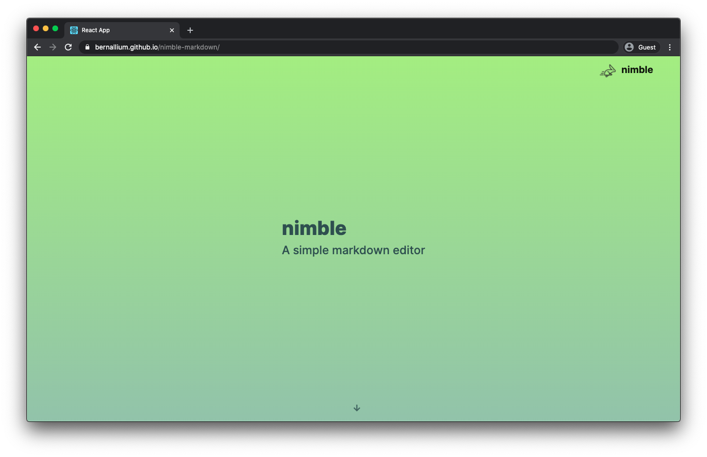
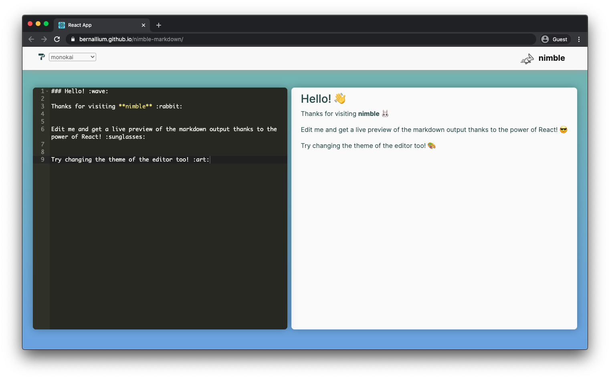
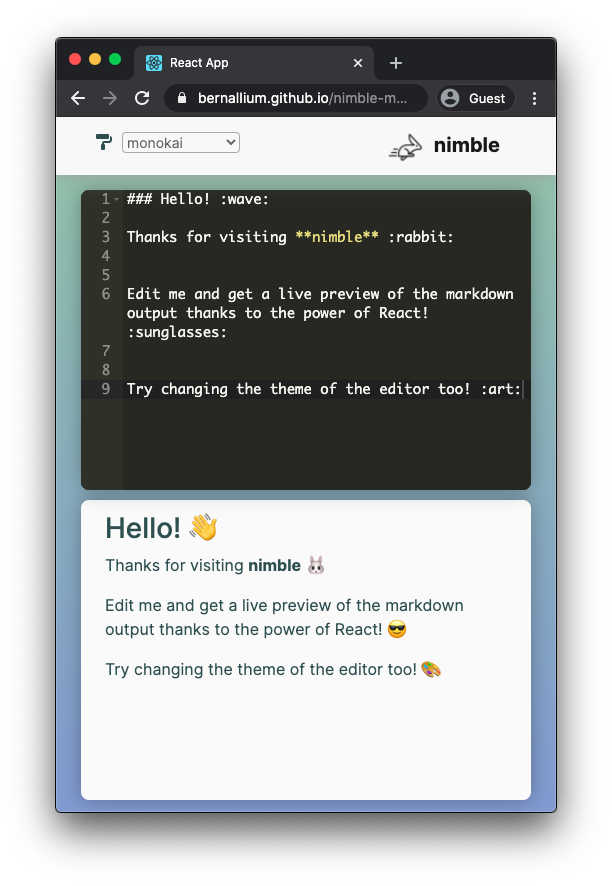

 

  

  <h3 align="center">nimble</h3>

  

    A simple markdown editor that gives you a live translation of your markdown input
     
    <a href="https://bernallium.github.io/nimble-markdown/"><strong>Click here to start ➜</strong></a>
  

  
  

  
  

## Built With 👨‍💻

* `React`
* [`React-Ace`](https://github.com/securingsincity/react-ace)
* [`ShowdownJS`](https://github.com/showdownjs/showdown)
